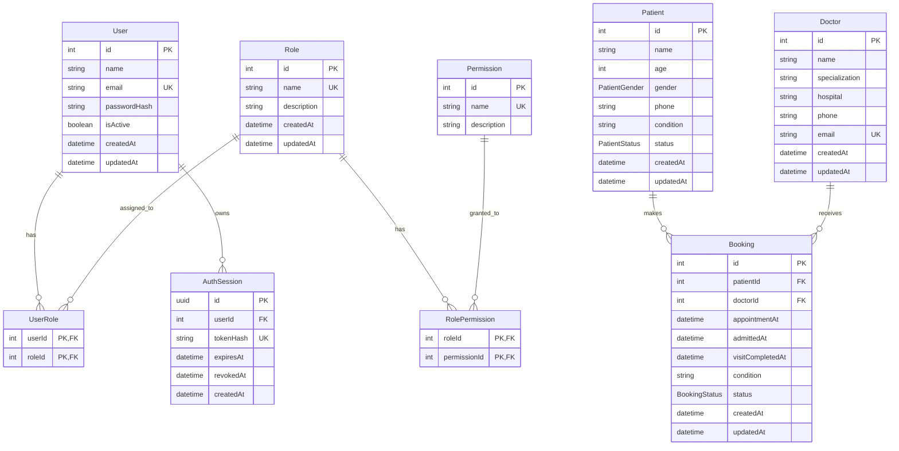

# Database Design

## Overview

The hospital management backend uses PostgreSQL through Prisma ORM. The database is divided into three main areas:

- Authentication and authorization: users, roles, permissions, and sessions.
- Hospital records: patients and doctors.
- Appointment management: bookings connecting patients with doctors.

The Prisma datasource and client generator are defined in `prisma/schema.prisma`. Models are separated by domain under `prisma/models`, while shared enums are stored under `prisma/enums`.

## Entity Relationship Diagram

`UK` identifies a unique key. Fields shown as optional in the table descriptions below may contain `NULL`.

## Authentication and Authorization

### User

Stores credentials and account state for a person who can authenticate with the application.

| Column | Type | Rules | Purpose |
| --- | --- | --- | --- |
| `id` | Integer | Primary key, auto-increment | User identifier |
| `name` | String | Required | Display name |
| `email` | String | Required, unique | Login identity |
| `passwordHash` | String | Required | One-way password hash; plaintext passwords are not stored |
| `isActive` | Boolean | Required, defaults to `true` | Enables or disables access without deleting the user |
| `createdAt` | DateTime | Defaults to the current time | Creation timestamp |
| `updatedAt` | DateTime | Automatically updated | Last modification timestamp |

A user can have multiple roles through `UserRole` and multiple login sessions through `AuthSession`.

### Role

Groups permissions into reusable access-control profiles.

| Column | Type | Rules | Purpose |
| --- | --- | --- | --- |
| `id` | Integer | Primary key, auto-increment | Role identifier |
| `name` | String | Required, unique | Stable role name |
| `description` | String | Optional | Human-readable explanation |
| `createdAt` | DateTime | Defaults to the current time | Creation timestamp |
| `updatedAt` | DateTime | Automatically updated | Last modification timestamp |

### Permission

Represents a granular action that may be assigned to roles.

| Column | Type | Rules | Purpose |
| --- | --- | --- | --- |
| `id` | Integer | Primary key, auto-increment | Permission identifier |
| `name` | String | Required, unique | Stable permission name |
| `description` | String | Optional | Human-readable explanation |

### UserRole

Implements the many-to-many relationship between users and roles.

| Column | Type | Rules |
| --- | --- | --- |
| `userId` | Integer | Composite primary key; foreign key to `User.id` |
| `roleId` | Integer | Composite primary key; foreign key to `Role.id` |

The composite primary key prevents the same role from being assigned to a user more than once. Deleting either the user or the role cascades to the corresponding assignment rows.

### RolePermission

Implements the many-to-many relationship between roles and permissions.

| Column | Type | Rules |
| --- | --- | --- |
| `roleId` | Integer | Composite primary key; foreign key to `Role.id` |
| `permissionId` | Integer | Composite primary key; foreign key to `Permission.id` |

The composite primary key prevents duplicate permission assignments. Deleting either side of the relationship cascades to its assignment rows.

### AuthSession

Stores server-side authentication sessions without persisting raw tokens.

| Column | Type | Rules | Purpose |
| --- | --- | --- | --- |
| `id` | UUID | Primary key | Session identifier |
| `userId` | Integer | Foreign key to `User.id` | Session owner |
| `tokenHash` | String | Required, unique | Hash used to validate a presented token |
| `expiresAt` | DateTime | Required, indexed | Expiration time |
| `revokedAt` | DateTime | Optional | Revocation time; `NULL` means not explicitly revoked |
| `createdAt` | DateTime | Defaults to the current time | Creation timestamp |

Deleting a user cascades to all of that user's sessions. Indexes on `userId` and `expiresAt` support session lookup and expiration cleanup.

## Hospital Records

### Patient

Stores the patient's basic demographic and clinical summary.

| Column | Type | Rules | Purpose |
| --- | --- | --- | --- |
| `id` | Integer | Primary key, auto-increment | Patient identifier |
| `name` | String | Required, indexed | Patient name |
| `age` | Integer | Required | Patient age |
| `gender` | `PatientGender` | Required, indexed | Patient gender classification |
| `phone` | String | Optional, indexed | Contact number |
| `condition` | String | Optional | Current condition summary |
| `status` | `PatientStatus` | Defaults to `Active`, indexed | Current care status |
| `createdAt` | DateTime | Defaults to the current time, indexed | Creation timestamp |
| `updatedAt` | DateTime | Automatically updated | Last modification timestamp |

A patient can have many bookings. Patient deletion is restricted while related bookings exist so appointment history cannot become orphaned.

### Doctor

Stores doctor identity, specialization, workplace, and contact information.

| Column | Type | Rules | Purpose |
| --- | --- | --- | --- |
| `id` | Integer | Primary key, auto-increment | Doctor identifier |
| `name` | String | Required, indexed | Doctor name |
| `specialization` | String | Required, indexed | Medical specialty |
| `hospital` | String | Optional, indexed | Associated hospital or facility |
| `phone` | String | Optional, indexed | Contact number |
| `email` | String | Optional, unique | Contact email |
| `createdAt` | DateTime | Defaults to the current time | Creation timestamp |
| `updatedAt` | DateTime | Automatically updated | Last modification timestamp |

A doctor can have many bookings. Doctor deletion is restricted while related bookings exist so appointment history remains valid.

## Appointment Management

### Booking

Represents an appointment or visit between exactly one patient and one doctor.

| Column | Type | Rules | Purpose |
| --- | --- | --- | --- |
| `id` | Integer | Primary key, auto-increment | Booking identifier |
| `patientId` | Integer | Foreign key to `Patient.id`, indexed | Booked patient |
| `doctorId` | Integer | Foreign key to `Doctor.id`, indexed | Assigned doctor |
| `appointmentAt` | DateTime | Required, indexed | Scheduled appointment time |
| `admittedAt` | DateTime | Optional | Time the patient was admitted |
| `visitCompletedAt` | DateTime | Optional | Time the visit was completed |
| `condition` | String | Optional | Condition or reason recorded for the visit |
| `status` | `BookingStatus` | Defaults to `Pending`, indexed | Current booking state |
| `createdAt` | DateTime | Defaults to the current time | Creation timestamp |
| `updatedAt` | DateTime | Automatically updated | Last modification timestamp |

The patient and doctor foreign keys both use `RESTRICT` deletion behavior. A referenced patient or doctor must therefore remain in the database until their bookings are removed or otherwise handled.

## Enumerations

### PatientGender

| Value | Meaning |
| --- | --- |
| `Female` | Female patient |
| `Male` | Male patient |
| `Other` | Another or non-specified classification |

### PatientStatus

| Value | Meaning |
| --- | --- |
| `Active` | Patient is currently receiving active care |
| `Monitoring` | Patient is being observed or followed up |
| `Recovered` | Patient has recovered |

### BookingStatus

| Value | Meaning |
| --- | --- |
| `Pending` | Appointment exists but is not yet confirmed |
| `Confirmed` | Appointment has been accepted or scheduled |
| `Admitted` | Patient has been admitted for the visit |
| `Completed` | Visit has finished |
| `Cancelled` | Appointment will not proceed |

A typical successful booking progresses from `Pending` to `Confirmed`, then `Admitted`, and finally `Completed`. `Cancelled` is a terminal alternative when the appointment does not proceed. The service layer is responsible for validating allowed transitions and keeping `admittedAt` and `visitCompletedAt` consistent with the status.

## Relationship and Deletion Rules

| Parent | Child | Cardinality | On parent deletion |
| --- | --- | --- | --- |
| `User` | `AuthSession` | One-to-many | Cascade |
| `User` | `UserRole` | One-to-many | Cascade |
| `Role` | `UserRole` | One-to-many | Cascade |
| `Role` | `RolePermission` | One-to-many | Cascade |
| `Permission` | `RolePermission` | One-to-many | Cascade |
| `Patient` | `Booking` | One-to-many | Restrict |
| `Doctor` | `Booking` | One-to-many | Restrict |

Cascade deletion is used for dependent authentication records that have no meaning without their parent. Restrict deletion is used for patient and doctor references because bookings are part of the hospital's operational history.

## Indexing Strategy

The schema defines indexes for common lookup and filtering operations:

- Patient searches by `name`, `phone`, `gender`, `status`, and `createdAt`.
- Doctor searches by `name`, `specialization`, `hospital`, and `phone`.
- Booking filtering by `patientId`, `doctorId`, `appointmentAt`, and `status`.
- Session lookup and cleanup by `userId` and `expiresAt`.
- Unique indexes for user email, role name, permission name, session token hash, and doctor email.

These indexes favor the application's expected read patterns. Additional indexes should be introduced only after observing real query plans and workload patterns, because each index adds storage and write overhead.

## Integrity Boundaries

The database enforces identifiers, uniqueness, required fields, relationships, defaults, and deletion rules. Some domain rules require application-level validation because they are not expressed as Prisma constraints in the current schema. These include:

- Ensuring patient age is within an acceptable range.
- Validating phone and email formats.
- Preventing invalid booking status transitions.
- Ensuring `admittedAt` and `visitCompletedAt` agree with the booking status.
- Preventing scheduling conflicts for a doctor when required by the business rules.
- Ensuring appointment and visit timestamps occur in a valid chronological order.

Backend validation remains the final safeguard before records are written through Prisma.
